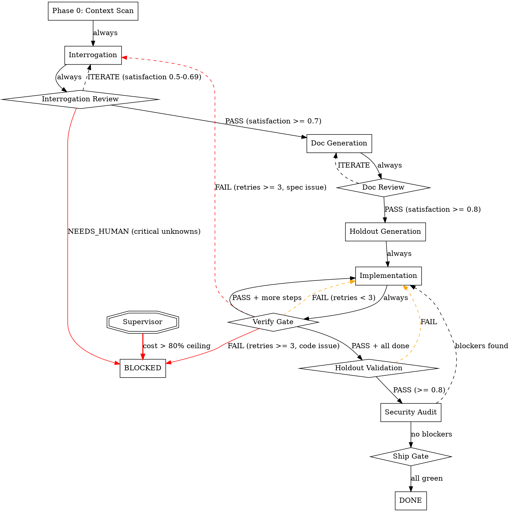

# Interrogation Protocol v3.0: Full Autonomy Implementation Guide

This guide transforms the Interrogation Protocol from an interactive Claude Code skills library (v2.1) into a fully autonomous spec-to-PR pipeline (v3.0) that requires zero human interaction between ticket assignment and PR creation.

Follow each step in order. Each step includes what to change, the exact files to create or modify, and how to verify the change works. Steps are grouped into 4 phases by priority.

---

## Prerequisites

Before starting, ensure:
- Claude Code CLI installed and authenticated
- Node.js 18+ (for Agent SDK)
- All MCP servers configured in .mcp.json
- Git repo initialized with remote

---

## PHASE 1: Ship-Blocking Fixes (Steps 1-5)

These 5 steps transform the system from "interactive toolkit" to "autonomous pipeline." Nothing else matters until these are done.

---

### Step 1: Create the Bash Harness (run-pipeline.sh)

**Gap:** The entire system has no way to run autonomously. All 13 commands require a human in an interactive terminal typing slash commands. Without a headless execution harness, the pipeline is not autonomous.

**What to create:** `run-pipeline.sh` - a bash script that orchestrates the full pipeline using `claude -p` (print/headless mode) with `--output-format json` for structured control, `--max-turns` for session limits, and `--max-budget-usd` for cost ceilings.

**File:** `run-pipeline.sh` (project root, chmod +x)

```bash
#!/usr/bin/env bash
set -euo pipefail

# ============================================================
# Interrogation Protocol v3.0 - Autonomous Pipeline Runner
# Usage: ./run-pipeline.sh "TICKET-ID or feature description"
# ============================================================

TICKET="${1:?Usage: ./run-pipeline.sh TICKET-ID}"
DATE=$(date +%Y-%m-%d-%H%M)
LOG_DIR="docs/artifacts/pipeline-runs/${DATE}"
CHECKPOINT_FILE="${LOG_DIR}/checkpoint.json"
COST_LOG="${LOG_DIR}/costs.json"
TOTAL_COST=0
MAX_PIPELINE_COST="${MAX_PIPELINE_COST:-50}"  # Total pipeline ceiling in USD
KILL_SWITCH_FILE=".pipeline-kill"

mkdir -p "$LOG_DIR"
echo '{"phases":[],"total_cost":0,"status":"running","started":"'$(date -Iseconds)'"}' > "$COST_LOG"

# Colors for output
RED='\033[0;31m'
GREEN='\033[0;32m'
YELLOW='\033[1;33m'
NC='\033[0m'

log() { echo -e "[$(date +%H:%M:%S)] $1"; }
log_phase() { echo -e "\n${GREEN}========== $1 ==========${NC}\n"; }
log_warn() { echo -e "${YELLOW}[WARN] $1${NC}"; }
log_error() { echo -e "${RED}[ERROR] $1${NC}"; }

# ---- Circuit Breakers ----

check_kill_switch() {
  if [ -f "$KILL_SWITCH_FILE" ]; then
    log_error "Kill switch activated. Stopping pipeline."
    log_error "Remove $KILL_SWITCH_FILE to re-enable."
    update_checkpoint "killed" "$1"
    exit 1
  fi
}

check_cost_ceiling() {
  if (( $(echo "$TOTAL_COST > $MAX_PIPELINE_COST" | bc -l) )); then
    log_error "Cost ceiling exceeded: \$${TOTAL_COST} > \$${MAX_PIPELINE_COST}"
    update_checkpoint "cost_exceeded" "$1"
    exit 1
  fi
}

# ---- Checkpoint Management ----

update_checkpoint() {
  local status="$1"
  local phase="${2:-unknown}"
  cat > "$CHECKPOINT_FILE" << EOF
{
  "status": "${status}",
  "current_phase": "${phase}",
  "ticket": "${TICKET}",
  "total_cost": ${TOTAL_COST},
  "timestamp": "$(date -Iseconds)",
  "log_dir": "${LOG_DIR}"
}
EOF
}

# ---- Phase Runner ----

run_phase() {
  local phase_name="$1"
  local prompt="$2"
  local max_turns="${3:-25}"
  local max_budget="${4:-5}"
  local extra_flags="${5:-}"

  check_kill_switch "$phase_name"
  check_cost_ceiling "$phase_name"
  log_phase "$phase_name"
  update_checkpoint "running" "$phase_name"

  local output_file="${LOG_DIR}/${phase_name}.json"

  # Run Claude in headless mode with structured output
  set +e
  claude -p "$prompt" \
    --output-format json \
    --max-turns "$max_turns" \
    --max-budget-usd "$max_budget" \
    --permission-mode acceptEdits \
    --model "${MODEL_OVERRIDE:-claude-opus-4-6}" \
    $extra_flags \
    > "$output_file" 2>"${LOG_DIR}/${phase_name}.stderr"
  local exit_code=$?
  set -e

  # Extract cost and session info
  local phase_cost=$(jq -r '.total_cost_usd // 0' "$output_file" 2>/dev/null || echo "0")
  local session_id=$(jq -r '.session_id // "unknown"' "$output_file" 2>/dev/null || echo "unknown")
  local is_error=$(jq -r '.is_error // false' "$output_file" 2>/dev/null || echo "false")
  local num_turns=$(jq -r '.num_turns // 0' "$output_file" 2>/dev/null || echo "0")

  TOTAL_COST=$(echo "$TOTAL_COST + $phase_cost" | bc -l)

  # Log cost
  log "Phase: $phase_name | Cost: \$${phase_cost} | Turns: ${num_turns} | Total: \$${TOTAL_COST}"

  # Append to cost log
  local tmp=$(mktemp)
  jq --arg name "$phase_name" \
     --argjson cost "$phase_cost" \
     --arg sid "$session_id" \
     --argjson turns "$num_turns" \
     --argjson total "$TOTAL_COST" \
     '.phases += [{"name":$name,"cost":$cost,"session_id":$sid,"turns":$turns}] | .total_cost=$total' \
     "$COST_LOG" > "$tmp" && mv "$tmp" "$COST_LOG"

  # Check for errors
  if [ "$exit_code" -ne 0 ] || [ "$is_error" = "true" ]; then
    log_error "Phase $phase_name failed (exit=$exit_code, is_error=$is_error)"
    log_error "Check ${LOG_DIR}/${phase_name}.json and .stderr for details"
    return 1
  fi

  log "Phase $phase_name complete."
  return 0
}

# ---- Stagnation Detection ----

check_stagnation() {
  local phase_name="$1"
  local attempt="$2"

  if [ "$attempt" -gt 1 ]; then
    # Compare last two error outputs for >90% similarity
    local prev="${LOG_DIR}/${phase_name}-attempt-$((attempt-1)).stderr"
    local curr="${LOG_DIR}/${phase_name}-attempt-${attempt}.stderr"
    if [ -f "$prev" ] && [ -f "$curr" ]; then
      local similarity=$(diff "$prev" "$curr" | wc -l)
      local total=$(wc -l < "$curr")
      if [ "$total" -gt 0 ] && [ "$similarity" -lt $((total / 10)) ]; then
        log_warn "Stagnation detected: attempt $attempt errors are >90% identical to attempt $((attempt-1))"
        return 1
      fi
    fi
  fi
  return 0
}

# ============================================================
# PIPELINE EXECUTION
# ============================================================

log "Starting autonomous pipeline for: $TICKET"
log "Max pipeline cost: \$${MAX_PIPELINE_COST}"
log "Kill switch file: $KILL_SWITCH_FILE"
log "Logs: $LOG_DIR"

# ---- Stage 1: Context Scan (Phase 0) ----

run_phase "phase0" \
  "You are running the Interrogation Protocol pipeline autonomously. Read CLAUDE.md first, then execute the phase0 context scan: scan git state, check Memory MCP for prior pipeline state, identify project type, TODOs, test status, blockers. Write a phase0-summary.md to docs/summaries/. Update Memory MCP with project_type, current_branch, test_status, blocker_count. Output must be under 20 lines." \
  15 2

# ---- Stage 2: Self-Interrogation ----

run_phase "interrogate" \
  "You are running the Interrogation Protocol pipeline autonomously for ticket: ${TICKET}.

Read CLAUDE.md, then docs/summaries/phase0-summary.md for project context.

Execute the full interrogation protocol (all 13 sections from .claude/skills/interrogate/SKILL.md). You are in AUTONOMOUS MODE - there is no human to answer questions. For each section:
1. Search MCP sources (Jira, Confluence, Slack, Google Drive) for answers
2. Search the codebase (README, configs, existing code patterns)
3. If you find an answer from a source, record it with the source citation
4. If you cannot find an answer, make a REASONABLE ASSUMPTION based on context and mark it clearly as [ASSUMPTION: reason]

Write ALL fetched MCP content to docs/artifacts/mcp-context-${DATE}.md.
Write the full interrogation transcript to docs/artifacts/interrogation-${DATE}.md.
Generate a pyramid summary to docs/summaries/interrogation-summary.md with:
  - Executive: 5 lines (core problem, user, stack, key constraint, MVP)
  - Detailed: 50 lines (all requirements, one per line)
  - Assumptions: list all assumptions made with confidence level (high/medium/low)
Update Memory MCP with pipeline_state=interrogated." \
  50 8

# ---- Stage 3: LLM-as-Judge Review of Interrogation ----

run_phase "interrogation-review" \
  "You are a REVIEWER agent. You did NOT write the interrogation output. Your job is to review it with fresh eyes.

Read docs/summaries/interrogation-summary.md and docs/artifacts/interrogation-${DATE}.md.

Evaluate:
1. Are all 13 sections addressed? List any gaps.
2. Are assumptions reasonable? Flag any that seem risky (mark NEEDS_HUMAN if critical).
3. Is there enough detail to generate implementation docs?
4. Are there contradictions between sections?

Score each section 1-5 (5=complete, 1=missing). Calculate overall satisfaction: (sum of scores) / (13 * 5) as a percentage.

Write your review to docs/artifacts/interrogation-review-${DATE}.md.
Write a 10-line summary to docs/summaries/interrogation-review.md.

If overall satisfaction >= 70%: output VERDICT: PASS
If any section scores 1 or any assumption marked NEEDS_HUMAN: output VERDICT: NEEDS_HUMAN
Otherwise: output VERDICT: ITERATE

Always include VERDICT: [PASS|NEEDS_HUMAN|ITERATE] as the last line of your response." \
  20 3 "--model claude-sonnet-4-5-20250929"

# Check review verdict
VERDICT=$(jq -r '.result // ""' "${LOG_DIR}/interrogation-review.json" 2>/dev/null | grep -oP 'VERDICT: \K\w+' || echo "UNKNOWN")
log "Interrogation review verdict: $VERDICT"

if [ "$VERDICT" = "NEEDS_HUMAN" ]; then
  log_error "Interrogation requires human input. Review: ${LOG_DIR}/interrogation-review.json"
  update_checkpoint "needs_human_interrogation" "interrogation-review"
  exit 2  # Exit code 2 = needs human
fi

if [ "$VERDICT" = "ITERATE" ]; then
  log_warn "Interrogation needs iteration. Re-running with review feedback."
  run_phase "interrogate-v2" \
    "Re-run interrogation addressing the gaps identified in docs/summaries/interrogation-review.md. Focus on sections that scored below 3. Update docs/summaries/interrogation-summary.md and docs/artifacts/interrogation-${DATE}.md." \
    30 5
fi

# ---- Stage 4: Document Generation ----

run_phase "generate-docs" \
  "You are running the Interrogation Protocol pipeline autonomously.

Read CLAUDE.md, then docs/summaries/interrogation-summary.md (Tier 2 - do NOT read the full interrogation transcript unless you need specific detail for a section).

Generate all applicable documents from docs/templates/:
- PRD.md, APP_FLOW.md, TECH_STACK.md, DATA_MODELS.md
- API_SPEC.md (if API project), FRONTEND_GUIDELINES.md (if frontend)
- IMPLEMENTATION_PLAN.md, TESTING_PLAN.md
- SECURITY_CHECKLIST.md, OBSERVABILITY.md, ROLLOUT_PLAN.md

Write each to docs/[name].md. For each doc:
1. Read the template from docs/templates/
2. Fill it from the interrogation summary
3. If detail needed, read specific sections from Tier 3 artifact
4. Do NOT keep all docs in conversation after writing them

After all docs are written:
1. Write docs/summaries/documentation-summary.md (pyramid format)
2. Update Memory MCP with pipeline_state=documented" \
  50 10

# ---- Stage 5: Doc Review (LLM-as-Judge) ----

run_phase "doc-review" \
  "You are a REVIEWER agent. Review the generated docs for completeness and consistency.

Read docs/summaries/documentation-summary.md for overview.
Spot-check 3-4 docs by reading them: docs/PRD.md, docs/IMPLEMENTATION_PLAN.md, docs/TESTING_PLAN.md, docs/DATA_MODELS.md.

Check:
1. Does PRD match interrogation requirements?
2. Does IMPLEMENTATION_PLAN have clear, ordered steps?
3. Does TESTING_PLAN cover critical paths?
4. Are there contradictions between docs?

Score overall satisfaction as a percentage.
If >= 80%: VERDICT: PASS
If < 80%: VERDICT: ITERATE with specific fixes needed.

Always include VERDICT: [PASS|ITERATE] as the last line." \
  20 3 "--model claude-sonnet-4-5-20250929"

# ---- Stage 6: Implementation Loop ----

# Read implementation steps from the plan
IMPL_STEPS=$(claude -p "Read docs/IMPLEMENTATION_PLAN.md and output ONLY a JSON array of step objects: [{\"id\": \"step-1\", \"title\": \"...\", \"description\": \"...\"}]. Output valid JSON only, no markdown fences." \
  --output-format json --max-turns 5 --max-budget-usd 1 2>/dev/null | jq -r '.result // ""' | grep -oP '\[.*\]' || echo "[]")

STEP_COUNT=$(echo "$IMPL_STEPS" | jq 'length' 2>/dev/null || echo "0")
log "Implementation plan has $STEP_COUNT steps"

for i in $(seq 0 $((STEP_COUNT - 1))); do
  STEP_ID=$(echo "$IMPL_STEPS" | jq -r ".[$i].id")
  STEP_TITLE=$(echo "$IMPL_STEPS" | jq -r ".[$i].title")
  STEP_DESC=$(echo "$IMPL_STEPS" | jq -r ".[$i].description")

  log_phase "Implementing: $STEP_ID - $STEP_TITLE"

  MAX_RETRIES=3
  for attempt in $(seq 1 $MAX_RETRIES); do
    check_kill_switch "implement-${STEP_ID}"
    check_cost_ceiling "implement-${STEP_ID}"

    # Get error context from previous attempt if retrying
    ERROR_CONTEXT=""
    if [ "$attempt" -gt 1 ]; then
      ERROR_CONTEXT="RETRY ATTEMPT ${attempt}/${MAX_RETRIES}. Previous error:
$(cat "${LOG_DIR}/verify-${STEP_ID}-attempt-$((attempt-1)).stderr" 2>/dev/null | head -50)"
    fi

    # Implement
    run_phase "implement-${STEP_ID}-attempt-${attempt}" \
      "You are implementing step ${STEP_ID}: ${STEP_TITLE}

Read CLAUDE.md for rules. Read docs/summaries/documentation-summary.md for context.
Read the specific doc sections relevant to this step.

Description: ${STEP_DESC}

${ERROR_CONTEXT}

Implement this step. Follow existing codebase patterns. Type everything. Handle all errors.
After implementation, run the project's type checker and linter to verify your changes compile.
Commit your changes with message: 'feat(${STEP_ID}): ${STEP_TITLE}'" \
      40 8

    # Verify
    set +e
    run_phase "verify-${STEP_ID}-attempt-${attempt}" \
      "You are a VERIFICATION agent. Verify that step ${STEP_ID} (${STEP_TITLE}) was implemented correctly.

Run all relevant checks in order (stop on first failure):
1. Type checking (tsc --noEmit / mypy / go vet / cargo clippy)
2. Linting (eslint / ruff / golint)
3. Tests (npm test / pytest / go test / cargo test) -- if tests exist
4. Build (npm run build / go build / cargo build)

If ALL pass: output VERDICT: PASS
If ANY fail: output VERDICT: FAIL with the specific error (first 50 lines only)

Always include VERDICT: [PASS|FAIL] as the last line." \
      15 3
    verify_exit=$?
    set -e

    VERIFY_VERDICT=$(jq -r '.result // ""' "${LOG_DIR}/verify-${STEP_ID}-attempt-${attempt}.json" 2>/dev/null | grep -oP 'VERDICT: \K\w+' || echo "UNKNOWN")

    if [ "$VERIFY_VERDICT" = "PASS" ]; then
      log "Step $STEP_ID verified on attempt $attempt"
      break
    fi

    log_warn "Step $STEP_ID failed verification (attempt $attempt/$MAX_RETRIES)"

    # Check stagnation
    if check_stagnation "verify-${STEP_ID}" "$attempt"; then
      log_error "Stagnation detected on step $STEP_ID. Escalating."
      update_checkpoint "stagnated" "verify-${STEP_ID}"
      # Don't exit - try a different approach
      ERROR_CONTEXT="${ERROR_CONTEXT}
STAGNATION DETECTED: Your previous fix attempts are producing the same errors. Try a fundamentally different approach."
    fi

    if [ "$attempt" -eq "$MAX_RETRIES" ]; then
      log_error "Step $STEP_ID failed after $MAX_RETRIES attempts. Blocking."
      update_checkpoint "blocked" "verify-${STEP_ID}"
      # Write block report
      echo "BLOCKED: Step ${STEP_ID} failed ${MAX_RETRIES} verification attempts." > "${LOG_DIR}/blocked-${STEP_ID}.txt"
      echo "See verify logs for details." >> "${LOG_DIR}/blocked-${STEP_ID}.txt"
      exit 3  # Exit code 3 = blocked
    fi
  done
done

# ---- Stage 7: Holdout Validation ----

if ls .holdouts/holdout-*.md 1>/dev/null 2>&1; then
  run_phase "holdout-validate" \
    "You are a HOLDOUT VALIDATION agent. Test the implementation against hidden scenarios.

Read each file in .holdouts/holdout-*.md. For each scenario:
1. Check if preconditions can be met in the current implementation
2. Walk through each step against the actual code
3. Evaluate each acceptance criterion (pass/fail)
4. Check each anti-pattern (triggered/clean)

Score: (satisfied scenarios / total scenarios) as percentage.
If >= 80% and 0 anti-pattern flags: VERDICT: PASS
If < 80% or any anti-pattern flags: VERDICT: FAIL with details.

Always include VERDICT: [PASS|FAIL] as the last line." \
    25 5 "--model claude-sonnet-4-5-20250929"

  HOLDOUT_VERDICT=$(jq -r '.result // ""' "${LOG_DIR}/holdout-validate.json" 2>/dev/null | grep -oP 'VERDICT: \K\w+' || echo "UNKNOWN")
  if [ "$HOLDOUT_VERDICT" = "FAIL" ]; then
    log_error "Holdout validation failed. Review: ${LOG_DIR}/holdout-validate.json"
    update_checkpoint "holdout_failed" "holdout-validate"
    exit 4  # Exit code 4 = holdout failure
  fi
fi

# ---- Stage 8: Security Audit ----

run_phase "security-audit" \
  "You are a SECURITY AUDITOR. Review the implementation for security issues.

Scan all source files for:
1. Hardcoded secrets, API keys, tokens
2. SQL injection, XSS, command injection vectors
3. Missing authentication/authorization checks
4. Insecure defaults (CORS *, debug mode)
5. Missing input validation
6. Sensitive data exposure in logs or errors

Severity levels: BLOCKER (must fix) | WARNING (should fix) | INFO (note)

If 0 BLOCKERs: VERDICT: PASS
If any BLOCKERs: VERDICT: FAIL with file:line and description

Always include VERDICT: [PASS|FAIL] as the last line." \
  20 3 "--model claude-sonnet-4-5-20250929"

SECURITY_VERDICT=$(jq -r '.result // ""' "${LOG_DIR}/security-audit.json" 2>/dev/null | grep -oP 'VERDICT: \K\w+' || echo "UNKNOWN")
if [ "$SECURITY_VERDICT" = "FAIL" ]; then
  log_warn "Security audit found blockers. Attempting auto-fix."
  run_phase "security-fix" \
    "Read docs/artifacts/pipeline-runs/${DATE}/security-audit.json. Fix all BLOCKER-severity issues. Do not change functionality, only fix security issues. Commit with message 'fix(security): address audit findings'" \
    20 5
fi

# ---- Stage 9: Ship ----

run_phase "ship" \
  "You are running the final SHIP phase.

Pre-flight checks:
1. Run full test suite one final time
2. Verify all implementation steps are committed
3. Verify no uncommitted changes (git status --porcelain)

If all pass, create a PR:
- Title: '${TICKET}: [generated title from PRD]'
- Body: built from docs/summaries/ (executive sections only)
- Include: test results, step count, holdout results if applicable

Push branch and create PR via gh CLI or GitHub MCP.
Update Memory MCP: pipeline_state=shipped

Output the PR URL as the last line." \
  20 5

# ---- Final Cost Report ----

update_checkpoint "completed" "ship"

echo ""
log_phase "PIPELINE COMPLETE"
echo ""
log "Ticket: $TICKET"
log "Total cost: \$$(printf '%.2f' $TOTAL_COST)"
log "Logs: $LOG_DIR"
log "Cost breakdown:"
jq -r '.phases[] | "  \(.name): $\(.cost) (\(.turns) turns)"' "$COST_LOG"
echo ""
log "Checkpoint: $CHECKPOINT_FILE"
log "Full cost log: $COST_LOG"
```

**Verification:**
```bash
chmod +x run-pipeline.sh
# Dry run - should fail gracefully on missing claude CLI
./run-pipeline.sh "TEST-001" 2>&1 | head -20
# Verify checkpoint file was created
cat docs/artifacts/pipeline-runs/*/checkpoint.json
```

---

### Step 2: Migrate .claude/commands/ to .claude/skills/

**Gap:** Anthropic deprecated `.claude/commands/` in Claude Code v2.1.3 (January 2026). The new `.claude/skills/` system adds auto-invocation, tool restrictions via frontmatter, and cross-product support.

**What to do:**
1. Rename `.claude/commands/` to `.claude/skills/`
2. Update all internal references
3. Update CLAUDE.md
4. Update README.md

**Commands:**
```bash
# Rename directory
mv .claude/commands/ .claude/skills/

# Update CLAUDE.md references
sed -i 's/\.claude\/commands/\.claude\/skills/g' CLAUDE.md
sed -i 's/\.claude\/commands/\.claude\/skills/g' README.md

# Update any cross-references within skill files
find .claude/skills/ -name "*.md" -exec sed -i 's/\.claude\/commands/\.claude\/skills/g' {} +

# Update references in agents
find .claude/agents/ -name "*.md" -exec sed -i 's/\.claude\/commands/\.claude\/skills/g' {} +

# Update references in rules
find .claude/rules/ -name "*.md" -exec sed -i 's/\.claude\/commands/\.claude\/skills/g' {} +
```

**Verification:**
```bash
# Confirm no remaining references to old path
grep -r "\.claude/commands" . --include="*.md" --include="*.json" | grep -v node_modules
# Should return nothing

# Confirm skills directory exists
ls .claude/skills/
```

---

### Step 3: Fix the No-Assumptions Autonomy Deadlock

**Gap:** `.claude/rules/no-assumptions.md` enforces a "zero assumptions policy" that creates a deadlock in autonomous mode: the agent can't proceed without data, can't assume, and can't ask a human who isn't there.

**What to modify:** `.claude/rules/no-assumptions.md`

**Replace the entire file with:**

```markdown
---
globs: ["**/*"]
---

# Assumptions Policy

## Interactive Mode (default)
- Never guess. If unclear, ASK.
- Never write code until documentation is approved.
- State assumptions explicitly before proposing solutions.
- Present options with trade-offs; don't just pick one.
- When pre-filling answers from MCP sources, confirm: "Based on [source], I believe [answer]. Correct?"
- If a question was skipped, document WHY it was skipped.
- When in doubt about scope, treat it as out of scope until confirmed.
- "I think" and "probably" are red flags. Replace with "I need to confirm" and ask.

## Autonomous Mode (activated when AUTONOMOUS_MODE=true or running via run-pipeline.sh)
When no human is available to answer questions:
1. SEARCH first: query all MCP sources (Jira, Confluence, Slack, Drive, codebase)
2. INFER second: use codebase patterns, industry conventions, and related context
3. ASSUME last: make the most reasonable assumption given available evidence

Every assumption MUST be:
- Marked explicitly: [ASSUMPTION: one-line rationale]
- Assigned confidence: HIGH (strong evidence) | MEDIUM (reasonable inference) | LOW (best guess)
- Logged to docs/artifacts/ for later human review
- Listed in the interrogation summary's Assumptions section

LOW confidence assumptions on critical topics (auth model, compliance, data retention) should be flagged as [NEEDS_HUMAN] rather than assumed.

The pipeline's LLM-as-Judge review phase will catch unreasonable assumptions before implementation proceeds.

## Spec-the-Gap (when assumptions aren't enough)
When an interrogation section has NO data from any source AND assumptions would be irresponsible (e.g., compliance requirements, data retention policies), generate a DRAFT spec:
1. Scan existing codebase for patterns that imply requirements (e.g., existing auth middleware implies auth is required)
2. Search similar open-source projects for industry conventions
3. Generate a draft spec section marked as [DRAFT_SPEC: generated from {source}]
4. DRAFT_SPECs are NOT assumptions - they are proposals that MUST be reviewed

Write all DRAFT_SPECs to docs/artifacts/draft-specs-[date].md.
The LLM-as-Judge review phase MUST flag all DRAFT_SPECs for explicit attention.

## MCP Pre-Fill Verification
When MCP sources pre-fill an answer, the agent MUST NOT uncritically accept it:
1. State the source: "Based on [Jira ticket X / Confluence page Y], I believe..."
2. Cross-reference: check if other sources contradict (e.g., Jira says Node.js but codebase is Python)
3. Freshness check: flag data older than 90 days as [STALE_SOURCE: last updated {date}]
4. Never let a single MCP source override multiple contradicting sources
```

**Also add to `.env.example`:**
```bash
# Autonomous mode (set to true when running via run-pipeline.sh)
AUTONOMOUS_MODE=true
```

**Verification:**
```bash
grep -c "AUTONOMOUS_MODE" .claude/rules/no-assumptions.md
# Should return at least 1
grep -c "ASSUMPTION" .claude/rules/no-assumptions.md
# Should return at least 3
```

---

### Step 4: Add CLI Flags Configuration

**Gap:** No phase specifies `--max-turns`, `--max-budget-usd`, or `--model`. Runaway phases can consume unlimited resources.

**What to create:** `pipeline.config.sh` - centralized configuration for all phase limits.

**File:** `pipeline.config.sh` (project root)

```bash
#!/usr/bin/env bash
# Pipeline phase configuration
# Edit these values to tune cost/quality tradeoffs

# Models per phase (use cheaper models for review/routing, Opus for generation)
MODEL_PHASE0="claude-sonnet-4-5-20250929"
MODEL_INTERROGATE="claude-opus-4-6"
MODEL_REVIEW="claude-sonnet-4-5-20250929"
MODEL_GENERATE_DOCS="claude-opus-4-6"
MODEL_IMPLEMENT="claude-opus-4-6"
MODEL_VERIFY="claude-sonnet-4-5-20250929"
MODEL_SECURITY="claude-sonnet-4-5-20250929"
MODEL_HOLDOUT="claude-sonnet-4-5-20250929"
MODEL_SHIP="claude-sonnet-4-5-20250929"

# Max turns per phase (circuit breaker)
TURNS_PHASE0=15
TURNS_INTERROGATE=50
TURNS_REVIEW=20
TURNS_GENERATE_DOCS=50
TURNS_IMPLEMENT=40
TURNS_VERIFY=15
TURNS_SECURITY=20
TURNS_HOLDOUT=25
TURNS_SHIP=20

# Max budget per phase in USD (circuit breaker)
BUDGET_PHASE0=2
BUDGET_INTERROGATE=8
BUDGET_REVIEW=3
BUDGET_GENERATE_DOCS=10
BUDGET_IMPLEMENT=8
BUDGET_VERIFY=3
BUDGET_SECURITY=3
BUDGET_HOLDOUT=5
BUDGET_SHIP=5

# Total pipeline ceiling
MAX_PIPELINE_COST=50

# Retry limits
MAX_VERIFY_RETRIES=3
MAX_INTERROGATION_ITERATIONS=2

# Stagnation detection
STAGNATION_SIMILARITY_THRESHOLD=90  # percent

# Kill switch
KILL_SWITCH_FILE=".pipeline-kill"
```

**Update `run-pipeline.sh`** to source this file:
```bash
# Add after the shebang line:
SCRIPT_DIR="$(cd "$(dirname "${BASH_SOURCE[0]}")" && pwd)"
source "${SCRIPT_DIR}/pipeline.config.sh"
```

Then replace all hardcoded values in `run-pipeline.sh` with the config variables.

**Verification:**
```bash
source pipeline.config.sh
echo "Interrogation budget: \$${BUDGET_INTERROGATE}, model: ${MODEL_INTERROGATE}"
```

---

### Step 5: Add Cost Reporting

**Gap:** No mechanism to track cumulative API spend, report per-phase costs, or alert when costs exceed expectations.

**This is already built into `run-pipeline.sh` from Step 1.** The `$COST_LOG` JSON file tracks per-phase costs, and the final report prints a breakdown. No additional work needed beyond what Step 1 creates.

**Enhancement:** Add a `/cost-report` skill that reads historical pipeline run costs.

**File:** `.claude/skills/cost-report/SKILL.md`

```markdown
---
description: "Show cost report for pipeline runs."
allowed-tools: Read, Bash
---

# Cost Report

Read cost logs from docs/artifacts/pipeline-runs/*/costs.json.

## Output
For each run:
- Date, ticket, status
- Per-phase cost and turn count
- Total cost

Summary across all runs:
- Average cost per pipeline run
- Most expensive phase (avg)
- Total spend to date
```

**Verification:**
```bash
ls .claude/skills/cost-report/SKILL.md
```

---

## PHASE 2: High-Impact Improvements (Steps 6-12)

These improve quality, reliability, and cost efficiency but the pipeline can run without them.

---

### Step 6: Graph-Based Routing Engine

**Gap:** The pipeline is linear. The Attractor's entire architecture is a graph with conditional edges, retry routing to arbitrary upstream nodes, and a 5-step edge selection hierarchy. Our pipeline can only retry within a single gate (verify retries itself), not route back to interrogation when docs fail.

**What to create:** `pipeline.graph.dot` - the Attractor-style graph definition, and routing logic in `run-pipeline.sh`.

**File:** `pipeline.graph.dot` (project root)



**Edge Selection Priority (5-step hierarchy):**
When a gate produces a verdict, select the next node by:
1. **Condition match**: If verdict matches an edge's label condition, take it
2. **Retry target**: If verdict is FAIL and the node has a `retry_target`, route there
3. **Fallback retry target**: If retries exhausted and `fallback_retry_target` exists, route there
4. **Default edge**: Take the edge with highest weight (prefer forward progress)
5. **Lexical tiebreak**: Alphabetical node name (deterministic fallback)

**Thread Mechanism for Session Isolation:**
Add to `run-pipeline.sh`:
```bash
# Thread IDs control session reuse
# Same thread_id = continue conversation (fidelity: full)
# New thread_id = fresh session (fidelity: summary:high)
# Fork thread_id = clone parent, branch (fidelity: summary:medium)

generate_thread_id() {
  echo "thread-$(date +%s)-$RANDOM"
}

# Track threads per phase
declare -A PHASE_THREADS
PHASE_THREADS[phase0]=$(generate_thread_id)

# When routing back to interrogate from verify failure:
# Fork the interrogation thread so it has original context + error info
fork_thread() {
  local parent="$1"
  local child=$(generate_thread_id)
  # Copy parent's session summary to child's input
  cp "${LOG_DIR}/${parent}-summary.md" "${LOG_DIR}/${child}-input.md" 2>/dev/null
  echo "$child"
}
```

**Routing Logic in run-pipeline.sh:**
Replace the linear stage progression with a routing function:
```bash
# Route based on verdict
route_from_gate() {
  local gate="$1"
  local verdict="$2"
  local retries="${3:-0}"

  case "${gate}:${verdict}" in
    "interrogation-review:PASS") echo "generate-docs" ;;
    "interrogation-review:ITERATE") echo "interrogate" ;;
    "interrogation-review:NEEDS_HUMAN") echo "BLOCKED" ;;
    "doc-review:PASS") echo "holdout-generate" ;;
    "doc-review:ITERATE") echo "generate-docs" ;;
    "verify:PASS") echo "next-step-or-holdout" ;;
    "verify:FAIL")
      if [ "$retries" -ge 3 ]; then
        # Determine if spec issue or code issue
        # Spec issue -> route back to interrogate
        # Code issue -> block
        echo "BLOCKED"
      else
        echo "implement"
      fi
      ;;
    "holdout-validate:PASS") echo "security-audit" ;;
    "holdout-validate:FAIL") echo "implement" ;;
    "security-audit:PASS") echo "ship" ;;
    "security-audit:FAIL") echo "implement" ;;
    *) echo "BLOCKED" ;;
  esac
}
```

---

### Step 6b: Add Checkpoint Serialization and Resume

**Gap:** Pipeline crashes require restart from scratch. No checkpoint after each phase.

**Already partially built in Step 1** via `checkpoint.json`. Enhance `run-pipeline.sh` with resume capability:

**Add to `run-pipeline.sh`** (after argument parsing):

```bash
# Resume support
RESUME_FROM=""
if [ "${2:-}" = "--resume" ] && [ -n "${3:-}" ]; then
  RESUME_FROM="$3"
  CHECKPOINT_DIR="$3"
  if [ -f "${CHECKPOINT_DIR}/checkpoint.json" ]; then
    RESUME_PHASE=$(jq -r '.current_phase' "${CHECKPOINT_DIR}/checkpoint.json")
    TOTAL_COST=$(jq -r '.total_cost' "${CHECKPOINT_DIR}/checkpoint.json")
    LOG_DIR="$CHECKPOINT_DIR"
    log "Resuming from phase: $RESUME_PHASE (cost so far: \$${TOTAL_COST})"
  else
    log_error "No checkpoint found at ${CHECKPOINT_DIR}/checkpoint.json"
    exit 1
  fi
fi

# Helper to check if we should skip a phase (for resume)
should_run_phase() {
  local phase="$1"
  if [ -z "$RESUME_FROM" ]; then
    return 0  # Not resuming, run everything
  fi
  # Check if this phase completed successfully in the checkpoint
  local completed=$(jq -r ".phases[] | select(.name==\"$phase\") | .name" "$COST_LOG" 2>/dev/null)
  if [ -n "$completed" ]; then
    log "Skipping $phase (already completed in previous run)"
    return 1
  fi
  return 0
}
```

**Usage:**
```bash
# Normal run
./run-pipeline.sh "TICKET-001"

# Resume from a failed run
./run-pipeline.sh "TICKET-001" --resume docs/artifacts/pipeline-runs/2026-02-23-1430
```

---

### Step 7: Multi-Model Per Phase

**Gap:** All phases use the same model. Using Sonnet for review/routing and Opus for generation saves cost while improving review quality through model diversity.

**Already configured in Step 4** via `pipeline.config.sh`. Update `run-pipeline.sh` to use the model configs:

In each `run_phase` call, pass the model via the `--model` flag (already shown in the Step 1 script for review phases). Ensure every `run_phase` call uses the appropriate `$MODEL_*` variable.

---

### Step 8: Circuit Breakers Beyond Max-3 Retry

**Gap:** Only `verify.md` has a retry limit. No per-phase time limits, no stagnation detection, no external kill switch. No cross-session progress tracking.

**Already built into Step 1:**
- Kill switch: checks for `.pipeline-kill` file before every phase
- Cost ceiling: checks cumulative cost before every phase
- Stagnation detection: compares consecutive error outputs
- Per-phase turn and budget limits via `--max-turns` and `--max-budget-usd`

**Enhancement 1: Time limit per phase using `timeout`:**

In `run_phase()`, wrap the claude call:

```bash
timeout "${PHASE_TIMEOUT:-600}" claude -p "$prompt" \
  --output-format json \
  ...
```

Add to `pipeline.config.sh`:
```bash
# Phase timeouts in seconds (10 min default)
TIMEOUT_PHASE0=120
TIMEOUT_INTERROGATE=600
TIMEOUT_GENERATE_DOCS=600
TIMEOUT_IMPLEMENT=600
TIMEOUT_VERIFY=300
TIMEOUT_SHIP=300
```

**Enhancement 2: Cross-session progress tracking (git-based):**

Add to `run-pipeline.sh`:
```bash
# Track git state between phases to detect real progress
LAST_COMMIT=""

check_git_progress() {
  local phase_name="$1"
  local current_commit=$(git rev-parse HEAD 2>/dev/null || echo "none")

  if [ "$phase_name" = "implement"* ] || [ "$phase_name" = "security-fix"* ]; then
    # Implementation phases MUST produce commits
    if [ "$current_commit" = "$LAST_COMMIT" ] && [ "$LAST_COMMIT" != "" ]; then
      log_warn "No new git commits after $phase_name - agent may not have made changes"
      return 1
    fi
  fi

  LAST_COMMIT="$current_commit"
  return 0
}

# Track consecutive no-progress phases
NO_PROGRESS_COUNT=0
MAX_NO_PROGRESS=3

after_phase() {
  local phase_name="$1"
  if ! check_git_progress "$phase_name"; then
    NO_PROGRESS_COUNT=$((NO_PROGRESS_COUNT + 1))
    if [ "$NO_PROGRESS_COUNT" -ge "$MAX_NO_PROGRESS" ]; then
      log_error "No git progress for $MAX_NO_PROGRESS consecutive implementation phases. Pipeline stalled."
      update_checkpoint "stalled_no_progress" "$phase_name"
      exit 3
    fi
  else
    NO_PROGRESS_COUNT=0
  fi
}
```

Call `after_phase "$phase_name"` after every `run_phase` that should produce code changes.

---

### Step 9: LLM-as-Judge Two-Session Verification

**Gap:** The verify phase reviews code in the same conceptual context that generated it, losing the "fresh eyes" benefit.

**Already addressed in Step 1** - the verify phase runs as a separate `run_phase` call with its own `claude -p` invocation, which creates a fresh session. The verification agent gets only the step description and runs checks independently.

**Enhancement for stronger separation:** Use a different model for verification (already configured in Step 4 as `MODEL_VERIFY="claude-sonnet-4-5-20250929"` vs `MODEL_IMPLEMENT="claude-opus-4-6"`).

---

### Step 10: CI/CD Integration

**Gap:** No GitHub Action or webhook trigger. The pipeline requires manual invocation.

**File:** `.github/workflows/autonomous-pipeline.yml`

```yaml
name: Autonomous Pipeline

on:
  issues:
    types: [labeled]
  workflow_dispatch:
    inputs:
      ticket:
        description: 'Ticket ID or feature description'
        required: true

permissions:
  contents: write
  pull-requests: write
  issues: write

jobs:
  run-pipeline:
    if: github.event.label.name == 'agent-ready' || github.event_name == 'workflow_dispatch'
    runs-on: ubuntu-latest
    timeout-minutes: 120

    steps:
      - uses: actions/checkout@v4

      - name: Setup Node.js
        uses: actions/setup-node@v4
        with:
          node-version: '20'

      - name: Install Claude Code
        run: npm install -g @anthropic-ai/claude-code

      - name: Determine ticket
        id: ticket
        run: |
          if [ "${{ github.event_name }}" = "workflow_dispatch" ]; then
            echo "ticket=${{ github.event.inputs.ticket }}" >> $GITHUB_OUTPUT
          else
            echo "ticket=${{ github.event.issue.number }}" >> $GITHUB_OUTPUT
          fi

      - name: Run pipeline
        env:
          ANTHROPIC_API_KEY: ${{ secrets.ANTHROPIC_API_KEY }}
          GITHUB_PAT: ${{ secrets.GITHUB_TOKEN }}
          AUTONOMOUS_MODE: true
          MAX_PIPELINE_COST: 50
        run: |
          chmod +x run-pipeline.sh
          ./run-pipeline.sh "${{ steps.ticket.outputs.ticket }}"

      - name: Upload logs
        if: always()
        uses: actions/upload-artifact@v4
        with:
          name: pipeline-logs
          path: docs/artifacts/pipeline-runs/
```

**Verification:**
```bash
ls .github/workflows/autonomous-pipeline.yml
# Validate YAML
python3 -c "import yaml; yaml.safe_load(open('.github/workflows/autonomous-pipeline.yml'))"
```

---

### Step 11: Six Context Fidelity Modes

**Gap:** The three-tier data classification (Context/Summary/Artifact) is a storage scheme, not a context window management system. Attractor uses six fidelity modes that control how much prior conversation carries forward.

**What to modify:** `.claude/rules/context-fidelity.md`

**Add this section after the existing Tier definitions:**

```markdown
## Fidelity Modes (per-phase context loading)

When the pipeline runner loads context for a new phase, it uses one of six fidelity modes to control how much data from the previous phase carries forward:

| Mode | What loads | When to use |
|------|-----------|-------------|
| full | Entire previous phase output | Same thread, continuation |
| truncate | First + last N lines of output | Quick reference, long outputs |
| compact | Key-value pairs only (Tier 1) | Routing decisions, gate checks |
| summary:high | Executive summary only (5 lines) | Cross-phase handoff (default) |
| summary:medium | Executive + detailed (55 lines) | When next phase needs specifics |
| summary:low | Executive + detailed + file list | Implementation phases |

### Default Fidelity Per Phase
- phase0 → interrogate: summary:high (just project state)
- interrogate → review: summary:medium (need to evaluate completeness)
- review → generate-docs: summary:medium (need requirements detail)
- generate-docs → implement: summary:low (need file-level specifics)
- implement → verify: compact (just check results, don't re-read code)
- verify → implement (retry): truncate (first 50 lines of error output)
- verify → ship: compact (just pass/fail status)

### Fidelity Escalation
If a phase fails and needs more context, escalate one level:
compact → summary:high → summary:medium → summary:low → full

Never start at "full" unless explicitly resuming a session.

### How Tiers Map to Fidelity Modes (Reconciliation)
The three-tier storage system and six fidelity modes serve different purposes but MUST be aligned:

| Storage Tier | Fidelity Modes That Load It | Location |
|---|---|---|
| Tier 1 (Context) | compact, all summary modes | Memory MCP |
| Tier 2 (Summary) | summary:high loads Executive only, summary:medium loads Executive+Detailed, summary:low loads all | docs/summaries/ |
| Tier 3 (Artifact) | full, truncate (partial) | docs/artifacts/ |

The tiers define WHERE data lives. Fidelity modes define HOW MUCH of each tier loads into a new session. They are complementary, not competing.

### Context Budget Alignment
`context-budget.md` estimates tokens. Fidelity modes control what loads. They work together:
1. `context-budget.md` runs FIRST and estimates total tokens for the phase
2. If estimate exceeds 60% of context window, downgrade fidelity one level
3. If estimate is under 30%, upgrade fidelity one level (agent has room for more context)
4. The pipeline harness applies this automatically via the `select_fidelity()` function

Add to `run-pipeline.sh`:
```bash
select_fidelity() {
  local default_mode="$1"
  local estimated_tokens="${2:-0}"
  local window_size="${CONTEXT_WINDOW:-200000}"  # Opus 4.6 = 1M, but target 200K effective
  local utilization=$(echo "$estimated_tokens * 100 / $window_size" | bc)

  if [ "$utilization" -gt 60 ]; then
    # Downgrade fidelity
    case "$default_mode" in
      "full") echo "summary:low" ;;
      "summary:low") echo "summary:medium" ;;
      "summary:medium") echo "summary:high" ;;
      "summary:high") echo "compact" ;;
      *) echo "compact" ;;
    esac
  elif [ "$utilization" -lt 30 ]; then
    # Upgrade fidelity
    case "$default_mode" in
      "compact") echo "summary:high" ;;
      "summary:high") echo "summary:medium" ;;
      "summary:medium") echo "summary:low" ;;
      *) echo "$default_mode" ;;
    esac
  else
    echo "$default_mode"
  fi
}
```
```

---

### Step 12: Edit Validation / Linting Gate

**Gap:** No automatic linting on file edits. SWE-agent research shows that rejecting edits with syntax errors improves performance by ~3%.

**What to modify:** `.claude/settings.json`

**Enhance the PostToolUse hook:**

```json
"PostToolUse": [
  {
    "matcher": "Write|Edit",
    "hooks": [
      {
        "type": "command",
        "command": "FILE=\"$CLAUDE_FILE\"; if [[ \"$FILE\" =~ \\.(ts|tsx)$ ]] && command -v npx >/dev/null 2>&1; then npx tsc --noEmit --pretty 2>&1 | head -20; fi; if [[ \"$FILE\" =~ \\.(ts|tsx|js|jsx|json|css|md)$ ]] && command -v prettier >/dev/null 2>&1; then prettier --write \"$FILE\" 2>/dev/null; fi; if [[ \"$FILE\" =~ \\.(py)$ ]] && command -v ruff >/dev/null 2>&1; then ruff check \"$FILE\" --fix 2>&1 | head -10; fi"
      }
    ]
  }
]
```

This runs the type checker and auto-formatter after every file write/edit, catching syntax errors immediately rather than waiting for the verify phase.

**Enhancement 2: AI-optimized test output (Carlini pattern)**

Agents waste context parsing verbose test output. Create a wrapper that filters to ERROR-only lines for agent consumption, while preserving full logs on disk:

**File:** `scripts/agent-test.sh` (chmod +x)

```bash
#!/usr/bin/env bash
# AI-optimized test runner: ERROR-only stdout, full verbose to log file
set -uo pipefail

LOG_FILE="docs/artifacts/test-output-$(date +%Y%m%d-%H%M%S).log"
mkdir -p docs/artifacts

# Detect project type and run tests
if [ -f package.json ]; then
  npm test 2>&1 | tee "$LOG_FILE" | grep -E "^(FAIL|ERROR|✕|✗|×|BROKEN|TypeError|ReferenceError|SyntaxError)" | head -50
  EXIT_CODE=${PIPESTATUS[0]}
elif [ -f pyproject.toml ] || [ -f requirements.txt ]; then
  pytest -v 2>&1 | tee "$LOG_FILE" | grep -E "^(FAILED|ERROR|E )" | head -50
  EXIT_CODE=${PIPESTATUS[0]}
elif [ -f go.mod ]; then
  go test ./... -v 2>&1 | tee "$LOG_FILE" | grep -E "^(--- FAIL|FAIL|panic)" | head -50
  EXIT_CODE=${PIPESTATUS[0]}
elif [ -f Cargo.toml ]; then
  cargo test 2>&1 | tee "$LOG_FILE" | grep -E "^(test .* FAILED|error\[)" | head -50
  EXIT_CODE=${PIPESTATUS[0]}
fi

echo ""
echo "--- Full log: $LOG_FILE ---"
echo "--- Total failures: $(grep -cE "FAIL|ERROR|BROKEN" "$LOG_FILE" 2>/dev/null || echo 0) ---"
exit ${EXIT_CODE:-1}
```

Update verify prompts in `run-pipeline.sh` to use `scripts/agent-test.sh` instead of raw test commands.

**Enhancement 3: --fast test sampling for rapid feedback**

During implementation retries, run a random 10% subset of tests for faster feedback. Full suite runs only on final verify and ship.

Add to `scripts/agent-test.sh`:
```bash
# Fast mode: run random 10% of tests
if [ "${FAST_TEST:-false}" = "true" ]; then
  if [ -f package.json ]; then
    # Jest: run only test files matching a random hash
    SEED=$RANDOM
    npx jest --listTests 2>/dev/null | shuf -n "$(( $(npx jest --listTests 2>/dev/null | wc -l) / 10 + 1 ))" | xargs npx jest --no-coverage 2>&1 | tee "$LOG_FILE"
    EXIT_CODE=${PIPESTATUS[0]}
  elif [ -f pyproject.toml ] || [ -f requirements.txt ]; then
    # Pytest: random 10% sampling
    pytest --co -q 2>/dev/null | shuf -n "$(( $(pytest --co -q 2>/dev/null | wc -l) / 10 + 1 ))" | xargs pytest -v 2>&1 | tee "$LOG_FILE"
    EXIT_CODE=${PIPESTATUS[0]}
  fi
fi
```

In `run-pipeline.sh`, use fast mode for retry attempts 1-2, full suite for attempt 3 and final verify:
```bash
if [ "$attempt" -lt "$MAX_RETRIES" ]; then
  FAST_TEST=true run_phase "verify-${STEP_ID}-attempt-${attempt}" ...
else
  FAST_TEST=false run_phase "verify-${STEP_ID}-attempt-${attempt}" ...
fi
```

---

## PHASE 3: Competitive Parity (Steps 13-18)

These bring the system to feature parity with StrongDM and other production autonomous systems.

---

### Step 13: Parallel Agent Execution via Agent Teams

**Gap:** All phases run sequentially. Doc generation, test writing, and security audit could run in parallel. The guide previously used raw bash backgrounding and `--worktree`, but Claude Code now ships Agent Teams (Feb 2026 research preview) which provides native multi-agent coordination with task dependencies, file-locking, and inter-agent messaging.

**Option A: Agent Teams (preferred, requires Claude Code with Agent Teams support)**

Agent Teams uses a lead session that coordinates teammates. The lead creates tasks, teammates self-claim them and work independently with their own context windows.

**File:** `.claude/skills/parallel-docs/SKILL.md`
```markdown
---
description: "Generate all documentation in parallel using Agent Teams."
allowed-tools: Read, Write, Bash, Glob, Task, mcp__memory__*
model: claude-opus-4-6
---

# Parallel Documentation via Agent Teams

You are the LEAD agent. Coordinate doc generation across teammates.

## Create Tasks for Teammates
Create these tasks (teammates will self-claim):

1. **generate-prd-appflow**: Read docs/summaries/interrogation-summary.md. Generate docs/PRD.md and docs/APP_FLOW.md from templates.
2. **generate-tech-data**: Read docs/summaries/interrogation-summary.md. Generate docs/TECH_STACK.md and docs/DATA_MODELS.md from templates.
3. **generate-api-frontend**: Read docs/summaries/interrogation-summary.md. Generate docs/API_SPEC.md and docs/FRONTEND_GUIDELINES.md from templates (skip if not applicable).
4. **generate-impl-test**: Read docs/summaries/interrogation-summary.md. Generate docs/IMPLEMENTATION_PLAN.md and docs/TESTING_PLAN.md from templates.
5. **generate-security-ops**: Read docs/summaries/interrogation-summary.md. Generate docs/SECURITY_CHECKLIST.md, docs/OBSERVABILITY.md, docs/ROLLOUT_PLAN.md from templates.

## Coordination Rules
- Each teammate reads ONLY the interrogation summary (not each other's output)
- No file conflicts: each task writes to distinct files
- When all tasks complete, you (lead) generate docs/summaries/documentation-summary.md
- If any teammate fails, retry that task (don't re-run succeeded tasks)
```

In `run-pipeline.sh`, invoke the Agent Teams skill:
```bash
# ---- Parallel doc generation via Agent Teams ----
if claude --version 2>/dev/null | grep -q "agent-teams"; then
  run_phase "generate-docs-parallel" \
    "Run /parallel-docs to generate all documentation in parallel using Agent Teams. Read .claude/skills/parallel-docs/SKILL.md for the task breakdown." \
    60 15
else
  # Fallback: bash backgrounding
  run_phase "generate-core-docs" "Generate PRD, APP_FLOW, TECH_STACK, DATA_MODELS, IMPLEMENTATION_PLAN..." 40 8 &
  PID_DOCS=$!
  run_phase "generate-test-plan" "Generate TESTING_PLAN..." 20 4 &
  PID_TESTS=$!
  run_phase "generate-security" "Generate SECURITY_CHECKLIST..." 15 3 &
  PID_SEC=$!
  wait $PID_DOCS || { log_error "Core docs failed"; exit 1; }
  wait $PID_TESTS || { log_error "Test plan failed"; exit 1; }
  wait $PID_SEC || { log_error "Security checklist failed"; exit 1; }
fi
```

**Option B: Parallel implementation steps with shared Git coordination**

For implementation steps that are independent, use `--worktree` with a lock file protocol to prevent conflicts:

```bash
# Shared Git coordination (Carlini pattern)
# Agents claim work by creating lock files
LOCK_DIR=".pipeline-locks"
mkdir -p "$LOCK_DIR"

claim_step() {
  local step_id="$1"
  local lock_file="${LOCK_DIR}/${step_id}.lock"
  # Atomic claim via mkdir (atomic on most filesystems)
  if mkdir "${lock_file}.d" 2>/dev/null; then
    echo "$$" > "$lock_file"
    return 0  # Claimed
  fi
  return 1  # Already claimed
}

release_step() {
  local step_id="$1"
  rm -rf "${LOCK_DIR}/${step_id}.lock" "${LOCK_DIR}/${step_id}.lock.d"
}

# Run independent steps in parallel with worktrees
run_parallel_steps() {
  local steps=("$@")
  local pids=()

  for step in "${steps[@]}"; do
    if claim_step "$step"; then
      (
        claude -p "Implement step $step..." --worktree --output-format json \
          --max-turns 40 --max-budget-usd 8 \
          > "${LOG_DIR}/implement-${step}.json" 2>&1
        release_step "$step"
      ) &
      pids+=($!)
    fi
  done

  # Wait for all and check results
  local any_failed=false
  for pid in "${pids[@]}"; do
    wait "$pid" || any_failed=true
  done

  # Merge worktrees back to main branch
  # Each worktree committed to its own branch, now merge
  for step in "${steps[@]}"; do
    git merge "worktree-${step}" --no-edit 2>/dev/null || {
      log_warn "Merge conflict on ${step} - will run sequentially"
      git merge --abort
      # Re-run this step in main branch
      run_phase "implement-${step}-sequential" "Implement step ${step}..." 40 8
    }
  done

  $any_failed && return 1 || return 0
}
```

---

### Step 14: Probabilistic Satisfaction Scoring

**Gap:** All gates use binary pass/fail. StrongDM uses probabilistic satisfaction scoring.

**What to modify:** The review phases in `run-pipeline.sh` already use satisfaction percentages (>= 70% for interrogation review, >= 80% for doc review). Extend this to all gates.

**Create:** `.claude/skills/satisfaction-score/SKILL.md`

```markdown
---
description: "Calculate probabilistic satisfaction score for any phase output."
allowed-tools: Read, Bash
---

# Satisfaction Scoring

Evaluate phase output on multiple dimensions. Each dimension scored 0.0 to 1.0.

## Dimensions
1. **Completeness**: Are all required sections/features present? (0=none, 1=all)
2. **Correctness**: Does the output match the spec? (0=wrong, 1=correct)
3. **Consistency**: No internal contradictions? (0=many, 1=none)
4. **Quality**: Code style, doc clarity, test coverage? (0=poor, 1=excellent)
5. **Safety**: No security issues, no unsafe patterns? (0=blockers, 1=clean)

## Aggregate Score
satisfaction = (completeness * 0.3) + (correctness * 0.3) + (consistency * 0.15) + (quality * 0.15) + (safety * 0.1)

## Thresholds
- >= 0.9: AUTO_PASS (proceed without review)
- 0.7 - 0.89: PASS_WITH_NOTES (proceed, log concerns)
- 0.5 - 0.69: ITERATE (re-run phase with feedback)
- < 0.5: BLOCK (needs fundamental rework or human input)

## Output Format
```json
{
  "completeness": 0.85,
  "correctness": 0.90,
  "consistency": 0.95,
  "quality": 0.80,
  "safety": 1.0,
  "aggregate": 0.878,
  "verdict": "PASS_WITH_NOTES",
  "notes": ["Missing error handling in auth flow", "No rate limiting docs"]
}
```
```

**Position Bias Mitigation:**

LLM judges exhibit position bias (preferring content shown first). For high-stakes gates, evaluate twice with swapped ordering:

Add to `run-pipeline.sh`:
```bash
run_review_with_bias_check() {
  local review_name="$1"
  local prompt_base="$2"
  local max_turns="$3"
  local max_budget="$4"
  local model="$5"

  # Run 1: normal order
  run_phase "${review_name}-pass1" "$prompt_base" "$max_turns" "$max_budget" "--model $model"

  # Run 2: swapped order + different model family
  local swapped_prompt="${prompt_base}

IMPORTANT: When evaluating sections, read them in REVERSE order (last section first). This reduces position bias."

  run_phase "${review_name}-pass2" "$swapped_prompt" "$max_turns" "$max_budget" "--model claude-sonnet-4-5-20250929"

  # Compare verdicts - only count as PASS if both agree
  local v1=$(jq -r '.result // ""' "${LOG_DIR}/${review_name}-pass1.json" 2>/dev/null | grep -oP 'VERDICT: \K\w+' || echo "UNKNOWN")
  local v2=$(jq -r '.result // ""' "${LOG_DIR}/${review_name}-pass2.json" 2>/dev/null | grep -oP 'VERDICT: \K\w+' || echo "UNKNOWN")

  if [ "$v1" = "$v2" ]; then
    echo "$v1"  # Consistent verdict
  else
    log_warn "Position bias detected: pass1=$v1, pass2=$v2. Using stricter verdict."
    if [ "$v1" = "FAIL" ] || [ "$v2" = "FAIL" ]; then echo "FAIL"
    elif [ "$v1" = "ITERATE" ] || [ "$v2" = "ITERATE" ]; then echo "ITERATE"
    elif [ "$v1" = "NEEDS_HUMAN" ] || [ "$v2" = "NEEDS_HUMAN" ]; then echo "NEEDS_HUMAN"
    else echo "$v1"
    fi
  fi
}
```

Use `run_review_with_bias_check` for interrogation-review and doc-review (highest-stakes gates). Skip for verify (automated/deterministic) and security audit (different concern).

**Wire Confidence Scores into the Harness:**

The satisfaction-score.md skill outputs JSON but nothing reads it. Add a parser to `run-pipeline.sh`:

```bash
parse_satisfaction() {
  local json_file="$1"
  local result=$(jq -r '.result // ""' "$json_file" 2>/dev/null)
  # Extract aggregate score from JSON block in result text
  echo "$result" | grep -oP '"aggregate"\s*:\s*\K[0-9.]+' || echo "0"
}

score_to_verdict() {
  local score="$1"
  if (( $(echo "$score >= 0.9" | bc -l) )); then echo "AUTO_PASS"
  elif (( $(echo "$score >= 0.7" | bc -l) )); then echo "PASS_WITH_NOTES"
  elif (( $(echo "$score >= 0.5" | bc -l) )); then echo "ITERATE"
  else echo "BLOCK"
  fi
}

# Usage in every review phase:
# SCORE=$(parse_satisfaction "${LOG_DIR}/interrogation-review.json")
# VERDICT=$(score_to_verdict "$SCORE")
# NEXT=$(route_from_gate "interrogation-review" "$VERDICT")
```

Update all review phases in `run-pipeline.sh` to use `parse_satisfaction` + `score_to_verdict` instead of raw grep for `VERDICT:` strings.

---

### Step 15: Digital Twin Universe (DTU) Bootstrap

**Gap:** No mock API replicas for testing third-party integrations.

**Create:** `.claude/skills/generate-dtu/SKILL.md`

```markdown
---
description: "Generate Digital Twin mock services for third-party API testing."
allowed-tools: Read, Write, Bash, Glob
argument-hint: "API name (e.g., stripe, auth0, sendgrid)"
---

# Generate Digital Twin

Creates a lightweight mock server that replicates the API contract of a third-party service, based on the API_SPEC.md and existing integration code.

## Process
1. Read docs/API_SPEC.md for external API dependencies
2. For each dependency (or $ARGUMENTS if specified):
   a. Scan codebase for how the API is called (endpoints, params, response shapes)
   b. Generate a mock server in tests/mocks/[service-name]/
   c. Include: all observed endpoints, realistic response data, common error responses
   d. Add a start script to package.json: "mock:[service]"
3. Update TESTING_PLAN.md with DTU usage instructions
4. Generate a docker-compose.test.yml that starts all mocks

## Mock Server Template (Node.js/Express)
Each mock gets:
- Express server on a unique port
- All endpoints the app calls
- Configurable responses (success, error, rate-limit)
- Request logging for verification
- Startup check endpoint: GET /health

## Usage in Tests
Tests import from tests/mocks/config.js which maps service names to localhost URLs.
Set environment variables to point at mocks instead of real APIs.

## Anti-Reward-Hacking via DTU
The implementation agent MUST NOT be able to see or modify DTU validation logic.
This prevents the agent from gaming tests by hardcoding expected responses.

Architecture:
1. DTU mocks live in tests/mocks/ (visible to implementation agent for endpoint discovery)
2. DTU VALIDATION LOGIC lives in .holdouts/ (hidden from implementation, loaded only by holdout-validate agent)
3. Holdout scenarios reference DTU endpoints but the acceptance criteria are opaque to the implementation agent
4. The holdout-validate agent runs in a SEPARATE session that cannot modify source code (read-only + run tests only)

Enforcement in run-pipeline.sh:
- Implementation phases use --permission-mode with a deny list for .holdouts/
- The holdout-validate phase uses --permission-mode that allows read-only on source + execute on tests
- DTU mocks include a tamper-detection header: if an implementation modifies mock responses, the mock logs it and holdout validation fails automatically

Add to each DTU mock server:
```javascript
// Tamper detection: log if anyone modifies responses at runtime
let responseModified = false;
app.use((req, res, next) => {
  if (req.method === 'PUT' || req.method === 'PATCH') {
    if (req.path.startsWith('/mock-config')) {
      responseModified = true;
      console.error('[DTU-TAMPER] Response modification detected');
    }
  }
  next();
});
app.get('/health', (req, res) => {
  res.json({ healthy: true, tampered: responseModified });
});
```
```

---

### Step 16: Holdout Auto-Generation After Doc Generation

**Gap:** Holdout generation is a separate manual step. It should run automatically after docs are generated.

**Update `run-pipeline.sh`** to add holdout generation between doc review and implementation:

```bash
# ---- Auto-generate holdouts ----
if [ ! -f .holdouts/holdout-001-*.md ]; then
  run_phase "holdout-generate" \
    "You are the HOLDOUT GENERATOR agent. You operate in COMPLETE ISOLATION from implementation.

Read docs/PRD.md, docs/APP_FLOW.md, docs/API_SPEC.md, and docs/DATA_MODELS.md.

Generate 8-12 adversarial test scenarios that:
- Test behavior IMPLIED but not explicitly stated in the spec
- Cover cross-feature interactions
- Test boundary conditions
- Validate security assumptions
- Check for reward-hacking anti-patterns (hardcoded returns, missing validation)

Write each to .holdouts/holdout-NNN-[slug].md using the standard format.
Start numbering at 001." \
    30 5 "--model claude-sonnet-4-5-20250929"
fi
```

---

### Step 17: Progress File Enhancement

**Gap:** Progress files don't match the richness of the C compiler project's living READMEs.

**Create:** `.claude/skills/update-progress/SKILL.md` (enhanced version)

Replace the current update-progress.md with a version that writes a comprehensive `PROGRESS.md` at the project root after each phase:

```markdown
---
description: "Update project progress file with living architecture and status."
allowed-tools: Read, Write, Bash, Glob, mcp__memory__*
---

# Update Progress

Write/update PROGRESS.md at project root with:

## Sections
1. **Current State**: What phase the pipeline is in, what's done, what's next
2. **Architecture**: Brief description of code structure (updated as implementation proceeds)
3. **Recent Changes**: Last 5 significant changes with commit hashes
4. **Failed Approaches**: What was tried and didn't work (prevents repetition)
5. **Known Issues**: Current bugs or gaps
6. **Assumptions Made**: All [ASSUMPTION] items from interrogation
7. **Remaining Work**: Steps left in IMPLEMENTATION_PLAN.md

Also update Memory MCP entities:
- pipeline_state, current_step, completed_steps, blocked_steps
- active_blockers, key_decisions, lessons_learned
```

---

### Step 18: Self-Healing Error Pattern Detection

**Gap:** No cross-session analysis of error patterns. The system doesn't learn from repeated failures.

**Create:** `.claude/skills/error-analysis/SKILL.md`

```markdown
---
description: "Analyze error patterns across pipeline runs and generate fixes."
allowed-tools: Read, Write, Bash, Glob, Grep
---

# Error Pattern Analysis

Scan all pipeline run logs for recurring error patterns.

## Process
1. Read all files matching docs/artifacts/pipeline-runs/*/verify-*.json
2. Extract error messages and failure reasons
3. Cluster similar errors (same file, same error type, same root cause)
4. For each cluster with 3+ occurrences:
   a. Identify the systemic cause
   b. Generate a prevention rule
   c. Add to .claude/rules/ as a new rule or append to existing
   d. If the fix is a code change, write it as a prescription in docs/artifacts/prescriptions/

## Output
- docs/artifacts/error-analysis-[date].md with full cluster analysis
- New/updated rules in .claude/rules/
- CLAUDE.md Absolute Rules updated if systemic (3+ occurrences)

This is the "Healer" pattern: observe, cluster, diagnose, prescribe, verify.
```

---

## PHASE 4: Production Excellence (Steps 19-22)

These are advanced patterns for organizations running the pipeline at scale.

---

### Step 19: Full Self-Healing Agent

**Gap:** No autonomous error diagnosis, investigation, or prescription application.

**Create:** `.claude/agents/healer.md`

```markdown
---
name: healer
description: "Autonomous self-healing agent. Watches pipeline behavior, clusters problems, generates fixes."
tools: Read, Write, Bash, Glob, Grep, mcp__memory__*
model: claude-opus-4-6
---

You are the HEALER agent. You watch the pipeline's behavior and fix systemic problems autonomously.

## Your Cycle
1. OBSERVE: Read all recent pipeline logs (docs/artifacts/pipeline-runs/)
2. CLUSTER: Group similar failures by error type, file, and root cause
3. DIAGNOSE: For each cluster, identify the systemic issue
4. INVESTIGATE: Read relevant source code, configs, and rules
5. PRESCRIBE: Write the fix (code change, rule update, config change)
6. APPLY: Make the change and commit with message "fix(healer): [description]"
7. VERIFY: Check if the fix resolves the cluster's test cases

## Triggers
Run after:
- Any pipeline run that ended in "blocked" or "stagnated" status
- 3+ consecutive verify failures across different pipeline runs
- Cost per pipeline run exceeding 2x the average

## What You Fix
- Recurring lint/typecheck errors from bad patterns in rules
- Test failures from incorrect assumptions in interrogation
- Security audit failures from missing rule coverage
- Performance issues from context bloat patterns

## What You Don't Fix
- One-off errors (only clusters of 3+)
- Spec-level issues (you fix the pipeline, not the product)
- Issues requiring architectural redesign
```

**Create:** `.claude/skills/heal/SKILL.md`

```markdown
---
description: "Run the Healer agent to diagnose and fix systemic pipeline failures."
allowed-tools: Read, Write, Bash, Glob, Grep, mcp__memory__*
---

# Run Healer

Delegate to the healer agent (Task tool) with access to:
- All pipeline run logs in docs/artifacts/pipeline-runs/
- All rules in .claude/rules/
- All source code
- Memory MCP for cross-session patterns

The healer runs in its own context and returns only:
- Number of clusters found
- Prescriptions applied
- Files changed

After healing, run the test suite to verify no regressions.
```

---

### Step 20: Supervisor Agent

**Gap:** No meta-level agent monitors pipeline health and can override/reroute.

**Create:** `.claude/agents/supervisor.md`

```markdown
---
name: supervisor
description: "Pipeline supervisor. Monitors cross-phase metrics, detects anomalies, overrides routing."
tools: Read, Bash, Glob, Grep, mcp__memory__*
model: claude-sonnet-4-5-20250929
---

You are the SUPERVISOR agent. You run between pipeline phases to check overall health.

## Checks
1. **Cost tracking**: Is this run on track vs average? Flag if 2x over.
2. **Progress tracking**: Are steps completing or stagnating?
3. **Quality tracking**: Are satisfaction scores trending up or down?
4. **Context health**: Are summaries staying within budget?

## Actions
- LOG: Record observation to docs/artifacts/supervisor-log.md
- WARN: Add warning to next phase's prompt
- REROUTE: Skip a phase or re-run a phase
- BLOCK: Stop the pipeline and request human review

## When to Block
- Total cost > 80% of ceiling with work remaining
- Same step failed 2x with identical errors (stagnation pre-check)
- Security audit found blockers that auto-fix couldn't resolve
- Holdout satisfaction dropped below 50%
```

---

### Step 21: Model Stylesheet

**Gap:** No CSS-like configuration for model selection per node type.

**Create:** `pipeline.models.json`

```json
{
  "default": "claude-opus-4-6",
  "overrides": {
    "routing": "claude-sonnet-4-5-20250929",
    "review": "claude-sonnet-4-5-20250929",
    "security": "claude-sonnet-4-5-20250929",
    "generation": "claude-opus-4-6",
    "implementation": "claude-opus-4-6",
    "holdout": "claude-sonnet-4-5-20250929",
    "healer": "claude-opus-4-6",
    "supervisor": "claude-sonnet-4-5-20250929"
  },
  "cost_weights": {
    "claude-opus-4-6": 1.0,
    "claude-sonnet-4-5-20250929": 0.2
  }
}
```

Update `run-pipeline.sh` to read from this file instead of `pipeline.config.sh` model variables.

---

### Step 22: Frequent Intentional Compaction (FIC)

**Gap:** No explicit compaction discipline targeting 40-60% context window utilization.

**Create:** `.claude/rules/compaction.md`

```markdown
---
globs: ["**/*"]
---

# Compaction Discipline (FIC Pattern)

Target: 40-60% context window utilization at all times.

## Rules
1. After any phase that produces output > 200 lines, generate a compacted artifact (< 200 lines)
2. Between Research/Plan/Implement phase boundaries, compact to a single artifact
3. Never carry raw MCP-fetched content across a phase boundary
4. If context estimate exceeds 60% of window, stop and compact before proceeding

## Compaction Triggers
- Output > 200 lines: compress to summary
- Phase boundary: write artifact + summary, start fresh
- Error log > 50 lines: compress to first 50 lines + error count
- MCP content: extract key facts, discard raw content

## Compaction Format
Every compacted artifact follows pyramid structure:
- Executive: 5 lines (key decisions/outcomes)
- Detailed: 50 lines (all findings, one per line)
- Reference: file path to full output

## Anti-patterns
- NEVER: carry full test output across phases
- NEVER: keep full Jira ticket text after extracting requirements
- NEVER: accumulate implementation history in conversation
- ALWAYS: write to disk first, then summarize into conversation
```

---

### Step 22b: Agent SDK Pipeline Runner (Python alternative to bash harness)

**Gap:** The bash harness (`run-pipeline.sh`) works but has limitations: no structured error handling, limited JSON parsing, fragile string-based verdict detection. The Claude Agent SDK (Python: `claude-agent-sdk-python`, TypeScript: `@anthropic-ai/claude-agent-sdk`) provides programmatic control with proper types, hooks, and MCP integration.

**File:** `run_pipeline.py` (project root)

```python
#!/usr/bin/env python3
"""
Interrogation Protocol v3.0 - Agent SDK Pipeline Runner
Alternative to run-pipeline.sh with structured types and proper error handling.

Install: pip install claude-agent-sdk-python
Usage: python run_pipeline.py "TICKET-ID"
"""
import asyncio
import json
import sys
import os
from datetime import datetime, timezone
from pathlib import Path
from dataclasses import dataclass, field

from claude_agent_sdk import (
    ClaudeAgent,
    AgentConfig,
    SessionConfig,
    ToolResult,
    Hook,
    HookEvent,
)


@dataclass
class PhaseConfig:
    name: str
    prompt: str
    model: str = "claude-opus-4-6"
    max_turns: int = 25
    max_budget_usd: float = 5.0
    timeout_seconds: int = 600
    fidelity: str = "summary:high"


@dataclass
class PhaseResult:
    name: str
    cost_usd: float = 0.0
    turns: int = 0
    verdict: str = "UNKNOWN"
    satisfaction_score: float = 0.0
    session_id: str = ""
    error: str | None = None


@dataclass
class PipelineState:
    ticket: str
    status: str = "running"
    current_phase: str = ""
    total_cost: float = 0.0
    max_cost: float = 50.0
    phases: list[PhaseResult] = field(default_factory=list)
    log_dir: Path = field(default_factory=lambda: Path("docs/artifacts/pipeline-runs") / datetime.now().strftime("%Y-%m-%d-%H%M"))
    kill_switch: Path = Path(".pipeline-kill")

    def check_kill_switch(self):
        if self.kill_switch.exists():
            raise RuntimeError(f"Kill switch activated: {self.kill_switch}")

    def check_cost_ceiling(self):
        if self.total_cost > self.max_cost:
            raise RuntimeError(f"Cost ceiling exceeded: ${self.total_cost:.2f} > ${self.max_cost:.2f}")

    def save_checkpoint(self):
        self.log_dir.mkdir(parents=True, exist_ok=True)
        checkpoint = {
            "status": self.status,
            "current_phase": self.current_phase,
            "ticket": self.ticket,
            "total_cost": self.total_cost,
            "timestamp": datetime.now(timezone.utc).isoformat(),
            "phases": [
                {"name": p.name, "cost": p.cost_usd, "turns": p.turns, "verdict": p.verdict}
                for p in self.phases
            ],
        }
        (self.log_dir / "checkpoint.json").write_text(json.dumps(checkpoint, indent=2))


def parse_verdict(result_text: str) -> str:
    """Extract VERDICT from agent output."""
    for line in reversed(result_text.split("\n")):
        if "VERDICT:" in line:
            return line.split("VERDICT:")[-1].strip().split()[0]
    return "UNKNOWN"


def parse_satisfaction(result_text: str) -> float:
    """Extract aggregate satisfaction score from JSON in output."""
    try:
        # Find JSON block with aggregate key
        import re
        match = re.search(r'"aggregate"\s*:\s*([\d.]+)', result_text)
        if match:
            return float(match.group(1))
    except (ValueError, AttributeError):
        pass
    return 0.0


async def run_phase(state: PipelineState, config: PhaseConfig) -> PhaseResult:
    """Run a single pipeline phase via Agent SDK."""
    state.check_kill_switch()
    state.check_cost_ceiling()
    state.current_phase = config.name
    state.save_checkpoint()

    print(f"\n{'='*60}")
    print(f"  Phase: {config.name}")
    print(f"  Model: {config.model} | Max turns: {config.max_turns} | Budget: ${config.max_budget_usd}")
    print(f"{'='*60}\n")

    agent = ClaudeAgent(
        config=AgentConfig(
            model=config.model,
            max_turns=config.max_turns,
            max_budget_usd=config.max_budget_usd,
            permission_mode="acceptEdits",
        ),
        session=SessionConfig(
            timeout_seconds=config.timeout_seconds,
        ),
    )

    try:
        result = await asyncio.wait_for(
            agent.run(config.prompt),
            timeout=config.timeout_seconds,
        )

        phase_result = PhaseResult(
            name=config.name,
            cost_usd=result.cost_usd,
            turns=result.num_turns,
            verdict=parse_verdict(result.text),
            satisfaction_score=parse_satisfaction(result.text),
            session_id=result.session_id,
        )

    except asyncio.TimeoutError:
        phase_result = PhaseResult(
            name=config.name,
            error=f"Timeout after {config.timeout_seconds}s",
        )
    except Exception as e:
        phase_result = PhaseResult(
            name=config.name,
            error=str(e),
        )

    # Save phase output
    state.log_dir.mkdir(parents=True, exist_ok=True)
    (state.log_dir / f"{config.name}.json").write_text(
        json.dumps({"result": result.text if not phase_result.error else phase_result.error, **vars(phase_result)}, indent=2, default=str)
    )

    state.total_cost += phase_result.cost_usd
    state.phases.append(phase_result)
    state.save_checkpoint()

    print(f"  Result: verdict={phase_result.verdict} cost=${phase_result.cost_usd:.2f} turns={phase_result.turns}")

    if phase_result.error:
        raise RuntimeError(f"Phase {config.name} failed: {phase_result.error}")

    return phase_result


async def main():
    ticket = sys.argv[1] if len(sys.argv) > 1 else "NO-TICKET"
    state = PipelineState(
        ticket=ticket,
        max_cost=float(os.environ.get("MAX_PIPELINE_COST", "50")),
    )

    print(f"Starting pipeline for: {ticket}")
    print(f"Max cost: ${state.max_cost:.2f}")
    print(f"Logs: {state.log_dir}")

    try:
        # Phase 0: Context Scan
        await run_phase(state, PhaseConfig(
            name="phase0",
            prompt="Read CLAUDE.md, scan git state, check Memory MCP. Write docs/summaries/phase0-summary.md.",
            model="claude-sonnet-4-5-20250929",
            max_turns=15, max_budget_usd=2.0,
        ))

        # Phase 1: Interrogation
        await run_phase(state, PhaseConfig(
            name="interrogate",
            prompt=f"Autonomous interrogation for ticket: {ticket}. AUTONOMOUS_MODE=true. Search MCP, infer, assume with tags. Write transcript and pyramid summary.",
            max_turns=50, max_budget_usd=8.0,
        ))

        # Phase 1b: Interrogation Review
        review = await run_phase(state, PhaseConfig(
            name="interrogation-review",
            prompt="Review docs/summaries/interrogation-summary.md. Score each section 1-5. Output VERDICT: PASS|ITERATE|NEEDS_HUMAN",
            model="claude-sonnet-4-5-20250929",
            max_turns=20, max_budget_usd=3.0,
        ))

        if review.verdict == "NEEDS_HUMAN":
            state.status = "needs_human"
            state.save_checkpoint()
            print("\nPipeline paused: human input needed for interrogation")
            sys.exit(2)

        # Phase 2: Doc Generation
        await run_phase(state, PhaseConfig(
            name="generate-docs",
            prompt="Generate all docs from templates using interrogation summary. Write to docs/.",
            max_turns=50, max_budget_usd=10.0,
        ))

        # Phase 3: Implementation (loop over steps)
        # ... (same implementation loop logic as bash, but with proper error types)

        # Phase 4: Ship
        await run_phase(state, PhaseConfig(
            name="ship",
            prompt=f"Run full test suite. Create PR for {ticket}. Output PR URL.",
            model="claude-sonnet-4-5-20250929",
            max_turns=20, max_budget_usd=5.0,
        ))

        state.status = "completed"

    except RuntimeError as e:
        state.status = "failed"
        print(f"\nPipeline failed: {e}")
        sys.exit(1)
    finally:
        state.save_checkpoint()
        print(f"\nTotal cost: ${state.total_cost:.2f}")
        print(f"Checkpoint: {state.log_dir / 'checkpoint.json'}")


if __name__ == "__main__":
    asyncio.run(main())
```

**When to use Python vs Bash:**
- Use `run-pipeline.sh` for quick setup, CI/CD, environments without Python 3.11+
- Use `run_pipeline.py` for production deployment with proper error handling, structured types, and extensibility (custom hooks, programmatic MCP, etc.)

---

## Internal Consistency Fixes (Step 23)

### 23a: Ensure all skills reference correct paths

```bash
# After Step 2 migration, verify no broken references
grep -rn "\.claude/commands" .claude/ docs/ CLAUDE.md README.md
# Fix any remaining references
```

### 23b: Standardize Memory MCP entity names

Create a canonical entity reference:

**File:** `docs/MEMORY_MCP_SCHEMA.md`

```markdown
# Memory MCP Entity Schema

All pipeline components MUST use these exact entity names.

## Pipeline State
- `pipeline_state`: enum [scanning, interrogating, documented, implementing, verifying, shipping, shipped, blocked, stagnated]
- `pipeline_ticket`: string (ticket ID)
- `pipeline_started`: ISO datetime
- `pipeline_cost`: float (cumulative USD)

## Phase Tracking
- `current_phase`: string (phase name)
- `current_step`: string (implementation step ID)
- `completed_steps`: JSON array of step IDs
- `blocked_steps`: JSON array of {step_id, reason, attempts}

## Verification State
- `verify_retry_count`: int (0-3, reset on step change)
- `verify_last_errors`: string (compressed, <500 chars)
- `verify_step_id`: string (step being verified)

## Project Context
- `project_type`: string (e.g., "node-typescript", "python-fastapi")
- `project_branch`: string (current git branch)
- `project_test_status`: enum [passing, failing, no-tests]
- `project_blocker_count`: int

## Quality Metrics
- `holdout_count`: int (total scenarios)
- `holdout_pass_rate`: float (0-1)
- `holdout_last_run`: ISO datetime
- `satisfaction_scores`: JSON object of phase scores

## Learnings
- `lessons_learned`: JSON array of {lesson, frequency, promoted}
- `error_clusters`: JSON array of {pattern, count, prescription}
```

### 23c: Update CLAUDE.md for v3.0

**Replace CLAUDE.md with:**

```markdown
# Interrogation Protocol v3.0

## Quick Reference
- Autonomous: `./run-pipeline.sh TICKET-ID`
- Interactive: `claude` then `/phase0` -> follow prompts
- Feature add: `/feature-add description`
- Cost report: `/cost-report`
- Heal pipeline: `/heal`

## Session Start
1. Run `/phase0` (mandatory, no exceptions)
2. Do not write code until docs are approved

## Context Discipline
- Each phase starts a FRESH session (never --continue across phases)
- Before each phase, check context budget (target: 40-60% utilization)
- Large outputs go to docs/artifacts/ (Tier 3), not conversation
- Between phases: artifact -> pyramid summary -> Memory MCP -> fresh session
- Fidelity modes: full | truncate | compact | summary:high | medium | low

## Canonical Docs (read on demand, never preload all)
- docs/PRD.md, APP_FLOW.md, TECH_STACK.md, DATA_MODELS.md
- docs/API_SPEC.md, FRONTEND_GUIDELINES.md, IMPLEMENTATION_PLAN.md
- docs/TESTING_PLAN.md, SECURITY_CHECKLIST.md, OBSERVABILITY.md, ROLLOUT_PLAN.md
- docs/MEMORY_MCP_SCHEMA.md (entity naming reference)

## Absolute Rules
- Never write code until documentation is approved
- Never skip verification after implementation steps
- Never proceed past a blocker without surfacing it
- Every error: root cause + prevention rule + lessons update
- Type everything. Handle all errors. Test critical paths.
- Match existing codebase patterns exactly.
- In autonomous mode: search -> infer -> assume (with [ASSUMPTION] tag)
- In interactive mode: never guess, ASK

## Gate Rules
- Verify gate: fail -> auto-retry (max 3) -> block
- Ship gate: all checks must pass before PR creation
- Holdout gate: >= 80% satisfaction required
- All review gates use LLM-as-judge (separate model from generator)

## Circuit Breakers
- Per-phase: --max-turns, --max-budget-usd, timeout
- Per-pipeline: MAX_PIPELINE_COST ceiling
- Kill switch: create .pipeline-kill to stop
- Stagnation: >90% similar errors across retries triggers reroute
```

### 23d: Verify holdout path consistency

```bash
# All three holdout commands must use the same path
grep -rn "\.holdouts" .claude/skills/*/SKILL.md
# Verify they all reference .holdouts/ consistently
```

### 23e: Update README.md for v3.0

The README needs to document:
- The autonomous pipeline (`run-pipeline.sh`)
- The CI/CD integration (GitHub Action)
- The configuration files (`pipeline.config.sh`, `pipeline.models.json`)
- The new skills and agents
- Exit codes (0=success, 1=error, 2=needs human, 3=blocked, 4=holdout fail)
- Cost management
- Kill switch usage

### 23f: Verify Rules Glob Patterns

**Gap:** `.claude/rules/*.md` files use `globs:` frontmatter to control which files they apply to. If files move or patterns are wrong, rules silently stop applying.

```bash
# Extract all glob patterns from rules and verify they match real files
echo "=== Rules Glob Verification ==="
for rule in .claude/rules/*.md; do
  rule_name=$(basename "$rule")
  # Extract globs from frontmatter
  globs=$(sed -n '/^---$/,/^---$/p' "$rule" | grep "globs:" | sed 's/globs: \[//;s/\]//;s/"//g;s/,/ /g')
  if [ -z "$globs" ]; then
    echo "WARN: $rule_name has no globs (applies to nothing)"
    continue
  fi
  for glob in $globs; do
    match_count=$(find . -path "./.git" -prune -o -path "$glob" -print 2>/dev/null | wc -l)
    if [ "$match_count" -eq 0 ] && [ "$glob" != "**/*" ]; then
      echo "FAIL: $rule_name glob '$glob' matches 0 files"
    else
      echo "OK: $rule_name glob '$glob' matches $match_count files"
    fi
  done
done
```

Fix any globs that match 0 files. Common issues:
- Rules targeting `src/**/*.ts` but source is in `app/` or `lib/`
- Rules using `*.py` (root only) instead of `**/*.py` (recursive)

### 23g: Verify MCP Tool Names in settings.json

**Gap:** `settings.json` lists allowed tools using `mcp__servername__toolname` format. If MCP server names in `.mcp.json` don't match the prefixes in `settings.json`, tools silently fail to authorize.

```bash
# Extract MCP server names from .mcp.json
echo "=== MCP Tool Name Verification ==="
MCP_SERVERS=$(jq -r '.mcpServers | keys[]' .mcp.json 2>/dev/null)

# Extract mcp__ prefixes from settings.json
SETTINGS_PREFIXES=$(jq -r '.permissions.allow[]' .claude/settings.json 2>/dev/null | grep "^mcp__" | sed 's/mcp__//;s/__.*//' | sort -u)

# Cross-reference
for server in $MCP_SERVERS; do
  if echo "$SETTINGS_PREFIXES" | grep -q "^${server}$"; then
    echo "OK: MCP server '$server' has matching permissions in settings.json"
  else
    echo "WARN: MCP server '$server' defined in .mcp.json but no mcp__${server}__* permissions in settings.json"
  fi
done

for prefix in $SETTINGS_PREFIXES; do
  if echo "$MCP_SERVERS" | grep -q "^${prefix}$"; then
    : # Already verified above
  else
    echo "FAIL: settings.json allows mcp__${prefix}__* but no '${prefix}' server in .mcp.json"
  fi
done
```

### 23h: Test Fallback Persistence Files

**Gap:** `progress.txt`, `lessons.md`, and `decisions.md` are fallback persistence for when Memory MCP is unavailable. The fallback logic is likely undertested.

```bash
# Test 1: Verify fallback files exist and are writable
echo "=== Fallback Persistence Test ==="
for file in progress.txt lessons.md decisions.md; do
  if [ -f "$file" ]; then
    echo "OK: $file exists"
    # Test write access
    echo "# test-$(date +%s)" >> "$file" && sed -i '$ d' "$file"
    echo "OK: $file is writable"
  else
    echo "WARN: $file does not exist (will be created on first use)"
    touch "$file"
    echo "CREATED: $file"
  fi
done

# Test 2: Verify skills reference correct fallback filenames
echo ""
echo "--- Fallback reference check ---"
for skill in .claude/skills/*/SKILL.md; do
  for file in progress.txt lessons.md decisions.md; do
    if grep -q "$file" "$skill" 2>/dev/null; then
      echo "OK: $(basename $(dirname $skill)) references $file"
    fi
  done
done

# Test 3: Simulate MCP unavailability
# The update-progress skill should gracefully fall back to file writes
# when Memory MCP times out or returns errors
echo ""
echo "NOTE: Manual test required - disable Memory MCP in .mcp.json temporarily"
echo "  and run /update-progress to verify fallback behavior."
```

### 23i: Oracle Pattern for Complex Verification

**Gap:** No oracle compiler pattern. When verification fails, the system retries blindly. An oracle uses a known-good reference to decompose what specifically broke.

**When to use:** Only applicable when there's a reference implementation or previous working version to compare against. Not useful for greenfield projects.

**File:** `.claude/skills/oracle-verify/SKILL.md`

```markdown
---
description: "Oracle verification: compare implementation against a known-good reference to pinpoint exactly what diverged."
allowed-tools: Read, Bash, Grep, Glob, Diff
argument-hint: "reference-branch or reference-directory"
---

# Oracle Verification

When standard verify fails repeatedly, use the Oracle pattern:

## Process
1. Identify the known-good reference:
   - Previous working commit: `git stash && npm test && git stash pop`
   - Reference branch: `git diff main..HEAD`
   - Reference implementation (if porting): compare file-by-file
2. For each failing test:
   a. Run the test against the reference (should pass)
   b. Run the test against current code (should fail)
   c. Diff the code paths touched by the test between reference and current
   d. The diff IS the bug location
3. Generate a targeted fix that aligns current code with reference behavior
4. Re-run only the specific failing test (fast feedback)

## When This Helps
- Refactoring: test suite was green, now it's red. The diff shows exactly what broke.
- Porting: reference implementation works, port doesn't. File-by-file comparison.
- Upgrades: old version works, new version doesn't. Behavior diff.

## When This Doesn't Help
- Greenfield (no reference exists)
- New features (nothing to compare against)
- The reference itself is wrong
```

---

## Verification Checklist

After completing all steps, verify the full system:

```bash
# 1. File structure
echo "=== Skills ===" && ls .claude/skills/
echo "=== Agents ===" && ls .claude/agents/
echo "=== Rules ===" && ls .claude/rules/
echo "=== Holdouts ===" && ls .holdouts/
echo "=== CI/CD ===" && ls .github/workflows/

# 2. No broken references
grep -rn "\.claude/commands" . --include="*.md" --include="*.json" --include="*.sh" | grep -v node_modules
# Should return nothing

# 3. Run-pipeline.sh is executable
test -x run-pipeline.sh && echo "OK" || echo "FAIL: not executable"

# 4. Pipeline config loads
source pipeline.config.sh && echo "Config OK: max cost=\$${MAX_PIPELINE_COST}"

# 5. All skills have frontmatter
for f in .claude/skills/*/SKILL.md; do
  head -1 "$f" | grep -q "^---" || echo "MISSING FRONTMATTER: $f"
done

# 6. Settings.json valid JSON
python3 -c "import json; json.load(open('.claude/settings.json'))" && echo "settings.json valid"

# 7. No assumptions deadlock
grep -c "AUTONOMOUS_MODE" .claude/rules/no-assumptions.md
# Should be >= 1

# 8. Memory MCP schema exists
test -f docs/MEMORY_MCP_SCHEMA.md && echo "Schema OK"

# 9. Cost report skill exists
test -f .claude/skills/cost-report/SKILL.md && echo "Cost report OK"

# 10. Healer agent exists
test -f .claude/agents/healer.md && echo "Healer OK"

# 11. CLAUDE.md under 50 lines
wc -l < CLAUDE.md
# Should be under 50

# 12. Total file count
find . -type f -not -path './.git/*' -not -path './node_modules/*' | wc -l

# 13. Graph definition exists
test -f pipeline.graph.dot && echo "Graph OK" || echo "FAIL: no pipeline.graph.dot"

# 14. Agent test script exists and is executable
test -x scripts/agent-test.sh && echo "Agent test runner OK" || echo "FAIL: scripts/agent-test.sh missing or not executable"

# 15. Routing function exists in harness
grep -q "route_from_gate" run-pipeline.sh && echo "Routing OK" || echo "FAIL: no route_from_gate in run-pipeline.sh"

# 16. Satisfaction score wired to harness
grep -q "parse_satisfaction" run-pipeline.sh && echo "Score parser OK" || echo "FAIL: satisfaction scores not wired to harness"

# 17. Position bias check exists
grep -q "bias_check\|pass2" run-pipeline.sh && echo "Bias check OK" || echo "FAIL: no position bias mitigation"

# 18. DTU tamper detection
grep -rq "DTU-TAMPER\|tampered" .claude/skills/generate-dtu/SKILL.md && echo "DTU anti-hack OK" || echo "WARN: DTU anti-reward-hacking not referenced"

# 19. Spec-the-gap exists
grep -q "DRAFT_SPEC" .claude/rules/no-assumptions.md && echo "Spec-the-gap OK" || echo "FAIL: no DRAFT_SPEC in assumptions policy"

# 20. MCP pre-fill verification exists
grep -q "Pre-Fill Verification\|STALE_SOURCE" .claude/rules/no-assumptions.md && echo "MCP pre-fill OK" || echo "FAIL: no MCP pre-fill verification"

# 21. Rules glob patterns valid (run 23f)
echo "=== Glob check ===" && for rule in .claude/rules/*.md; do
  globs=$(sed -n '/^---$/,/^---$/p' "$rule" | grep "globs:" | head -1)
  [ -z "$globs" ] && echo "WARN: $(basename $rule) has no globs"
done

# 22. MCP tool names match (run 23g)
test -f .mcp.json && test -f .claude/settings.json && echo "MCP config files present" || echo "WARN: missing .mcp.json or settings.json"

# 23. Fallback persistence files writable
for f in progress.txt lessons.md decisions.md; do
  touch "$f" 2>/dev/null && echo "OK: $f writable" || echo "FAIL: $f not writable"
done

# 24. Oracle skill exists
test -f .claude/skills/oracle-verify/SKILL.md && echo "Oracle OK" || echo "FAIL: no oracle-verify/SKILL.md"

# 25. Python runner exists (optional)
test -f run_pipeline.py && echo "Python runner OK" || echo "INFO: no run_pipeline.py (optional)"

# 26. Cross-session progress tracking in harness
grep -q "check_git_progress\|NO_PROGRESS_COUNT" run-pipeline.sh && echo "Git progress tracking OK" || echo "FAIL: no cross-session progress tracking"

# 27. Context budget alignment
grep -q "select_fidelity" run-pipeline.sh && echo "Fidelity auto-select OK" || echo "FAIL: no select_fidelity in harness"
```

---

## Exit Codes Reference

| Code | Meaning | Action |
|------|---------|--------|
| 0 | Pipeline complete, PR created | Review PR |
| 1 | Phase error or kill switch | Check logs |
| 2 | Needs human input | Review interrogation-review.json, provide answers |
| 3 | Blocked after max retries | Check blocked-[step].txt, investigate manually |
| 4 | Holdout validation failed | Review holdout results, fix implementation |

---

## Summary: What Changed v2.1 -> v3.0

| Component | v2.1 | v3.0 |
|-----------|------|------|
| Execution | Interactive slash commands | `run-pipeline.sh` headless bash harness + `run_pipeline.py` (Agent SDK) |
| Skills dir | `.claude/commands/` (deprecated) | `.claude/skills/` |
| Human gates | 3 required human approvals | LLM-as-judge (separate model, position bias mitigation) |
| Assumptions | Zero assumptions policy | Search -> infer -> assume with tags + spec-the-gap + MCP pre-fill verification |
| Cost control | None | Per-phase budget + pipeline ceiling + kill switch |
| Session limits | None | --max-turns + --max-budget-usd + timeout |
| Stuck detection | Max 3 retries on verify only | Stagnation + cost ceiling + kill switch + git progress tracking |
| Model strategy | Single model | Multi-model (Opus for gen, Sonnet for review) |
| CI/CD | None | GitHub Action on issue label |
| Parallelism | Sequential only | Agent Teams (lead/teammates) + worktree + lock files |
| Fidelity modes | 3 tiers (storage) | 6 modes (context loading) + tier reconciliation + budget alignment |
| Self-healing | None | Healer agent + error clustering |
| Supervision | None | Supervisor agent between phases |
| Holdouts | Manual only | Auto-generated after doc gen |
| Edit validation | Prettier only | Prettier + type checker + linter on every edit |
| Checkpoints | None | JSON checkpoint after every phase, resume support |
| Cost reporting | None | Per-phase costs, pipeline total, historical analysis |
| DTU | None | Mock service generation + anti-reward-hacking tamper detection |
| Progress files | progress.txt (minimal) | PROGRESS.md (living architecture doc) |
| Routing | Linear stage progression | Graph-based with DOT definition, 5-step edge selection, conditional routing |
| Test output | Raw verbose | AI-optimized ERROR-only stdout + full logs to disk + --fast 10% sampling |
| Verification | Retry same approach | Oracle pattern (diff against known-good reference) |
| Scoring | Binary pass/fail string grep | Probabilistic satisfaction scores wired to harness routing |
| Git coordination | None | Lock file protocol for parallel agents, merge conflict recovery |
| Consistency checks | Manual | Automated: glob verification, MCP tool names, fallback persistence testing |
